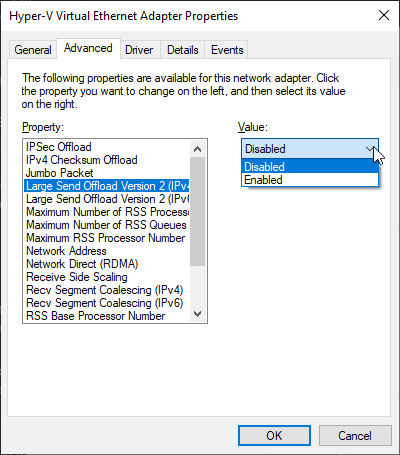
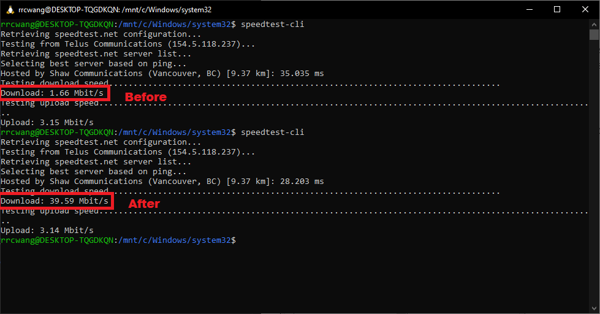
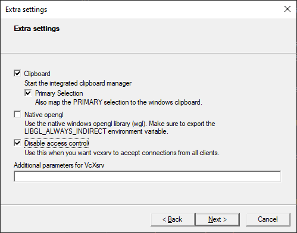

Written to document and share my experience with ROS in WSL Ubuntu for UBC's [CPSC 515 course](https://sites.google.com/view/ubccpsc515winter2020/online-adaptation).

## Using ROS with Windows Subsystem for Linux

The *Windows Subsystem for Linux* (WSL) allows Windows 10 users to directly run *many* Linux programs. This requires a similar effort to get going than running it natively in Windows 10 x64, and has a few key advantages:
* We can directly follow ROS guides made for Ubuntu and ROS Melodic in lieu of adapting tutorials to the Windows distribution
  * For example, the [Windows ROS installation guide](http://wiki.ros.org/Installation/Windows) is for ROS 2, and not ROS Melodic as required for the course
* Requires less disk space (unless you already have Visual Studio 2019 set up)
* We'll have a fully functional Linux dev environment for this course and future projects
* You can continue to use your preferred Windows text editor and preferences

The main drawback is that this is likely less performant than the native Windows installation. Using these [benchmarking](https://www.phoronix.com/scan.php?page=article&item=wsl-wsl2-tr3970x&num=1) tests as a reference the difference is small but non-negligible.

 I have not had a chance to compare ROS/Gazebo in WSL Ubuntu to that ROS Windows 10 personally, but it's been very usable on my desktop computer so far (Intel Core i5-9400F, 16 GB memory). I've tried a few different simple Gazebo simulations. In the past I have used Octave extensively in WSL with few issues.

### Requirements:
* Windows 10 x64 updated to version 1903 or higher, Build 18362 or higher
  * Check the Windows 10 build version by running `winver` in Powershell or cmd.
* ~4 GB disk space in the system drive C:\

### Installation Instructions

For these steps I've adapted the guide linked [here](https://jack-kawell.com/2020/06/12/ros-wsl2/). Credits go to [Jack Kawell](https://jack-kawell.com/) for his detailed guide.

#### 1. Installing and Configuring Ubuntu 18.04 for WSL

##### 1.1. Enabling WSL2

Installing and setting up WSL2 is pretty straightforward (you can see the full docs [here](https://docs.microsoft.com/en-us/windows/wsl/install-win10)). *You will need to do this even if you already have WSL1 installed.* First, you need to enable the WSL optional feature in Windows so open up a PowerShell prompt as Administrator and run this command:

```powershell
dism.exe /online /enable-feature /featurename:Microsoft-Windows-Subsystem-Linux /all /norestart
```

You need to enable the Virtual Machine Platform optional feature by running the below command in PowerShell as Administrator:

```powershell
dism.exe /online /enable-feature /featurename:VirtualMachinePlatform /all /norestart
```

You then need to restart your machine to finish the WSL install and the upgrade to WSL2.

After the restart, we want to make sure that WSL2 is our default WSL version so that any Linux distros installed from here on out will be WSL2 (though you can always upgrade or downgrade distros later on). To set WSL2 as the default, run the below command in a PowerShell prompt:

```powershell
wsl --set-default-version 2 
```

After running this command, you may see this message: `WSL 2 requires an update to its kernel component. For information please visit https://aka.ms/wsl2kernel.` If you do, go to [the link](https://aka.ms/wsl2kernel) in the message and update your Linux kernel by installing the MSI that you download from that site. Once the kernel is installed, run the above command again and verify that the message doesn’t appear.

If you *already have a WSL1 installation of Ubuntu 18.04*, you can upgrade it to WSL2 using the command below:

```powershell
wsl --set-version Ubuntu-18.04 2 # change a distro to WSL2
```

##### 1.2. Installing Ubuntu 18.04

If you don’t already have Ubuntu installed through WSL1, let’s go ahead and install it now! Head over to the Microsoft Store app and search for “Ubuntu 18.04 LTS”. Select it then click install. This might take a bit depending on your internet speeds since the distribution is large.

Now we can launch Ubuntu 18.04 LTS through the Start menu. It will take a bit the first time as it needs to run through the initialization of the OS (remember that we are installing a complete operating system here). However, every other boot of WSL will only take a couple of seconds.

Now you’re in! You have an (almost) fully-featured version of Ubuntu running within Windows with minimal resources being taken up and the ability to launch and kill it in a matter of seconds.

**NOTE:** Your WSL2 filesystem resides within your Windows file explorer at `\\wsl$\Ubuntu-18.04`

##### 1.3. Configuring Networking for WSL

This step is *OPTIONAL* but highly recommended.

Networking by default can be painfully slow in WSL, resulting in ~1-40 kbps download speeds. This is espcially noticable with `apt`. This is fixed by disabling the WSL network adapter's *Large Send Offload* feature ([Source](https://github.com/microsoft/WSL/issues/4901#issuecomment-650266654)). This is a [known issue](https://social.technet.microsoft.com/Forums/windowsserver/de-DE/bdc40358-45c8-4c4b-883b-a695f382e01a/very-slow-network-performance-with-intel-nic-when-tcp-large-send-offload-is-enabled?forum=winserverhyperv) with Hyper-V hardware virtualization on Windows. 

The menu to disable the feature can be found as:
`Control Panel` -> `Network and Internet` -> `Network and Sharing Center` -> `Change Adapter Settings` -> Right click on `vEthernet (WSL)` -> `Properties` -> `Configure` -> `Advanced` tab

<p align="center">
  
</p>

***Change the value in the dropdown menu to the right to*** `Disabled` ***for both IPv4 and IPv6.***

The speedtest results after the fix was applied made it comparable to the speedtest results in Windows natively. 

<p align="center">
  
</p>

The actual download speed of `apt` when installing ROS went up by 2 orders of magnitude.

#### 2. Setting Up GUI Forwarding

##### 2.1. Installing VcXsrv

There are many X-server applications that will allow for GUI forwarding from WSL2. In this guide we will use VcXsrv, as recommended by the original author. Go [here](https://sourceforge.net/projects/vcxsrv/) to download and install it.

##### 2.2. Running and Configuring VcXsrv

Once you run the installer you can launch it from the Start menu with the program `XLaunch`. You will need to do this each time you want to use GUI applications in WSL, such as the `turtlesim` program in the [Understanding ROS Nodes](http://wiki.ros.org/ROS/Tutorials/UnderstandingNodes) tutorial. 

Use the default settings for the first two menus. In the third menu, uncheck *Native opengl* and enable *Disable access control*.

<p align="center">
  <b> Menu 3:  <br> </b>

  
</p>

In the last menu, you can optionally save this configuration as a file for future use. Directly run the file to start VcXsrv with these settings. 

Once you click **Finish** you should see the VcXsrv icon down in your icon tray which means the server is running.

##### 2.3. Setting DISPLAY Environment Variable in Ubuntu

We will now set the `DISPLAY` environment variable which tells WSL2 where to send the graphics for any application that needs a display to function. 

Run the following three commands in the bash shell:

```bash
echo 'export DISPLAY=$(awk '/nameserver / {print $2; exit}' /etc/resolv.conf 2>/dev/null):0' >> ~\.bashrc
echo 'export LIBGL_ALWAYS_INDIRECT=0' >> ~\.bashrc
source ~/.bashrc
```
Now everything should be setup for GUI apps to be sent on to Windows for rendering and display. If you want to test the setup, you can install some basic apps within Ubuntu with the below package:

```bash
sudo apt update
sudo apt install x11-apps
```

And then run:

```bash
xcalc
```
To run one of the apps and test the X-server. 

#### 3. Installing ROS

Congratulations, our WSL environment is now ready! You can now directly follow all guides written for ROS Melodic for Ubuntu, including the one for [Ubuntu install of ROS Melodic](http://wiki.ros.org/melodic/Installation/Ubuntu). Go head and follow the linked guide.

Once complete, we can go ahead and begin the ROS beginner's tutorials.
